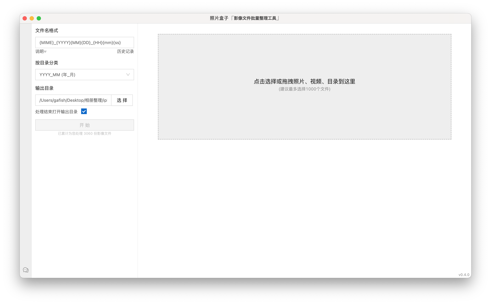
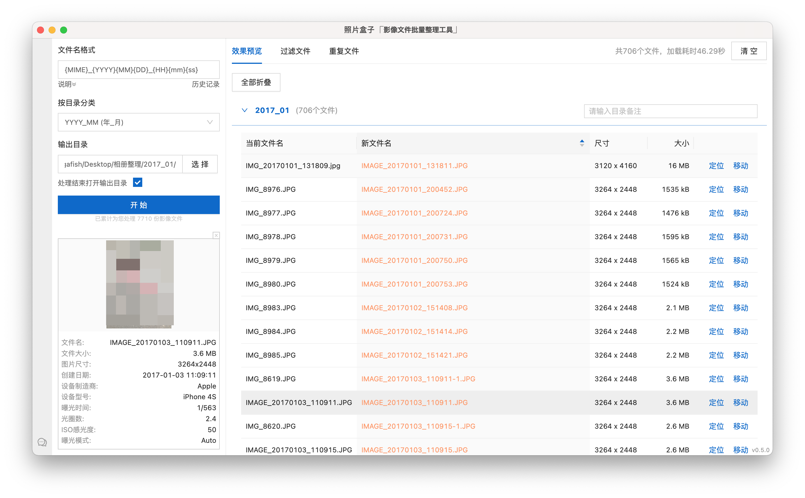
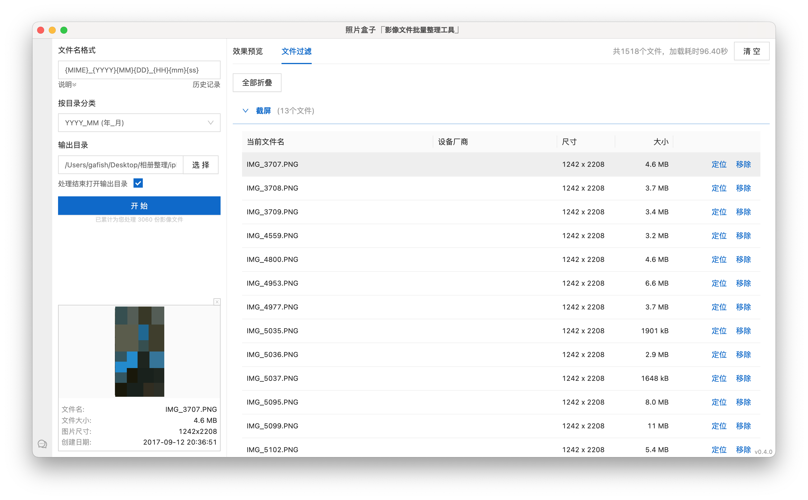

# 照片盒子

当前版本：v0.2.0

一个用于批量整理照片的工具

## 功能清单

- 自定义文件名格式，批量重命名照片、视频
- 按拍摄日期目录分类，目录支持备注
- 文件按类型过滤
- 查看基本的文件Exif信息
- 图片、视频文件预览

## 软件截图

软件初始界面

查看照片详情及预览，支持按日期目录分类

重命名后的文件列表

## 更新记录

### 0.3.0
- [新增] 文件按类型过滤
- [新增] 支持直接将文件及目录拖拽到APP
- [新增] 预览列表页分类可全部展开与折叠
- [新增] HEIC/VOD/MP4文件支持预览
- [新增] 增加升级提示弹层
- [bugfix] 修复选中文件无法取消的问题

### 0.2.0
- [新增] 按拍摄日期目录分类，目录支持备注
- [新增] 缓存当前操作设置项及文件列表，页面刷新可继续操作
- [新增] 设置项增加处理完打开输出目录选项

### 0.1.0
- [新增] 照片、视频批量重命名功能
- [新增] 文件Exif基本信息查看
- [新增] App 升级提示
